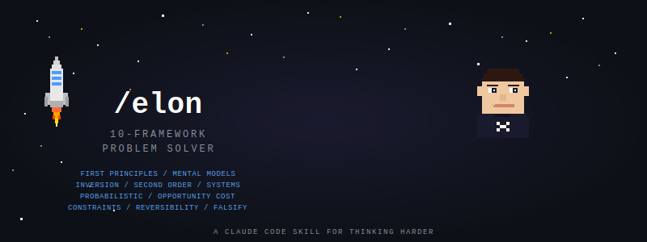

<p align="center">
  
</p>

<p align="center">
  <strong>A Claude Code skill that runs 10 thinking frameworks on any problem.</strong><br/>
  First Principles. Mental Models. Inversion. Second Order. Systems.<br/>
  Probabilistic. Opportunity Cost. Constraints. Reversibility. Falsification.
</p>

<p align="center">
  <a href="#install">Install</a> &bull;
  <a href="#frameworks">Frameworks</a> &bull;
  <a href="#usage">Usage</a> &bull;
  <a href="#why">Why</a> &bull;
  <a href="LICENSE">MIT License</a>
</p>

---

## Why

Most people solve problems with whatever framework they happen to know. That usually means one lens, one blind spot, one predictable mistake.

The best problem solvers (Musk, Munger, Bezos) don't think harder. They think through more lenses. First principles to strip assumptions. Inversion to map failures. Probabilistic thinking to quantify uncertainty. Systems thinking to find leverage. They run the same problem through multiple frameworks until the answer that survives all of them emerges.

`/elon` does that in one command. Ten frameworks, applied sequentially, each building on the last. The output isn't a vague recommendation. It's a structured analysis with concrete artifacts: assumption lists, failure mode tables, probability ranges, system maps, opportunity cost comparisons, and a falsification test that tries to break its own conclusion.

It works on anything: product decisions, architecture choices, career moves, business strategy, hiring, pricing, market entry.

## Install

### One-line install

```bash
mkdir -p ~/.claude/skills/elon && curl -fsSL https://raw.githubusercontent.com/LeifErikH/elon-skill/main/SKILL.md -o ~/.claude/skills/elon/SKILL.md
```

### Manual install

1. Clone this repo (or just grab SKILL.md)
2. Copy it to your Claude Code skills directory:

```bash
mkdir -p ~/.claude/skills/elon
cp SKILL.md ~/.claude/skills/elon/SKILL.md
```

3. Restart Claude Code or start a new conversation. `/elon` will appear in your skill list.

### Verify

In any Claude Code session, you should see `elon` listed when Claude shows available skills.

## Usage

### Full pipeline (all 10 frameworks)

```
/elon Should I rewrite our monolith into microservices?
```

or just:

```
/elon
```

...and it will ask you for the problem.

### Quick decision mode

```
/elon quick Should I switch from Postgres to MongoDB for this feature?
```

Runs the reversibility test first. If it's a two-way door (you can undo it cheaply), you get a fast answer. If it's a one-way door, it automatically runs the full pipeline.

### Single framework

```
/elon inversion What could go wrong with launching in Europe first?
/elon systems Why does our deploy process keep breaking?
/elon constraints What's slowing down our sprint velocity?
/elon opportunity-cost Should I build this feature or fix tech debt?
```

Available frameworks: `first-principles`, `mental-models`, `inversion`, `second-order`, `systems`, `probabilistic`, `opportunity-cost`, `constraints`, `reversibility`, `falsify`

## Frameworks

### The Pipeline

Each framework produces a concrete artifact. They run in order, with later frameworks building on earlier findings.

| # | Framework | What It Does | Output |
|---|-----------|-------------|--------|
| 1 | **DECOMPOSE** | First principles. Kill assumptions, find fundamental truths. | Assumptions killed, truths surviving, rebuilt solution space |
| 2 | **CROSS-POLLINATE** | Mental models from 3+ disciplines. Find where they converge and contradict. | Discipline map, convergence points, cross-domain insight |
| 3 | **INVERT** | Pre-mortem. Map every failure mode before building anything. | Failure mode table with likelihood x severity, deal-breaker flags |
| 4 | **RIPPLE** | Second and third order consequences. What happens after what happens. | Consequence chain, 12-month surprise test |
| 5 | **SYSTEMS** | Feedback loops and leverage points. Fix the system, not the symptom. | System map, reinforcing/balancing loops, highest-leverage intervention |
| 6 | **QUANTIFY** | Assign probabilities. Calculate expected value. Kill binary thinking. | Probability ranges, EV calculations, cheapest test to reduce uncertainty |
| 7 | **COMPARE** | Opportunity cost. Every yes is a no to something else. | Top 3 alternatives forgone, do-nothing option, verdict |
| 8 | **BOTTLENECK** | Theory of constraints. Find the ONE binding constraint. | Bottleneck ID, exploit/subordinate/elevate steps |
| 9 | **SPEED** | One-way vs two-way door. Calibrate how much analysis this deserves. | Door type, cost of wrong vs slow, decision deadline |
| 10 | **FALSIFY** | Try to break your own conclusion. Steelman the opposition. | Falsification tests, strongest counter-argument, survive/revise/restart |

### The Synthesis

After all 10 frameworks, you get:

```
PROBLEM (reframed): How the problem looks after 10 lenses
RECOMMENDATION:     Clear, specific action
KEY INSIGHT:        The single most non-obvious finding
CONFIDENCE:         X/10 with reasoning
RISKS ACCEPTED:     What could go wrong that you're choosing to accept
NEXT ACTION:        The literal next thing to do, today
DECISION DEADLINE:  When to decide by
```

## Origins

The core 5 frameworks (First Principles, Mental Models, Inversion, Second Order, Systems) are adapted from [Alex Prompter's thread](https://x.com/alex_prompter) on Elon Musk's thinking frameworks.

The additional 5 (Probabilistic, Opportunity Cost, Constraints, Reversibility, Falsification) draw from Charlie Munger's latticework of mental models, Goldratt's Theory of Constraints, Bezos's one-way/two-way door framework, and Popper's falsificationism. Added because the original 5 had gaps: no uncertainty quantification, no resource tradeoff lens, no operational bottleneck analysis, no decision-speed calibration, and no epistemic check against being confidently wrong.

## Requirements

- [Claude Code](https://docs.anthropic.com/en/docs/claude-code) (CLI, desktop app, or IDE extension)
- That's it. No API keys, no dependencies, no build step.

## Contributing

PRs welcome. If you have a framework that fills a genuine gap (not redundant with the existing 10), open an issue first to discuss.

Good additions: actionable, complementary, proven by elite decision-makers.
Bad additions: philosophical fluff, motivational frameworks, anything that doesn't produce a concrete artifact.

## License

[MIT](LICENSE)
